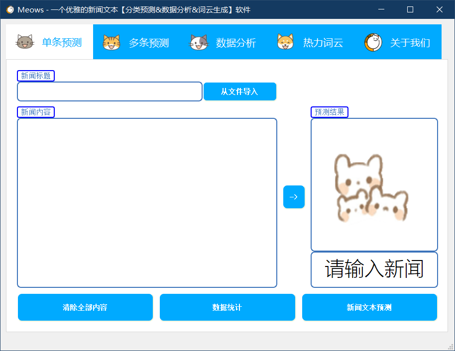
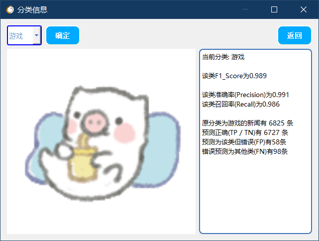
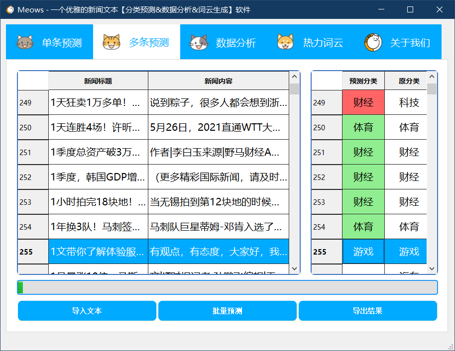
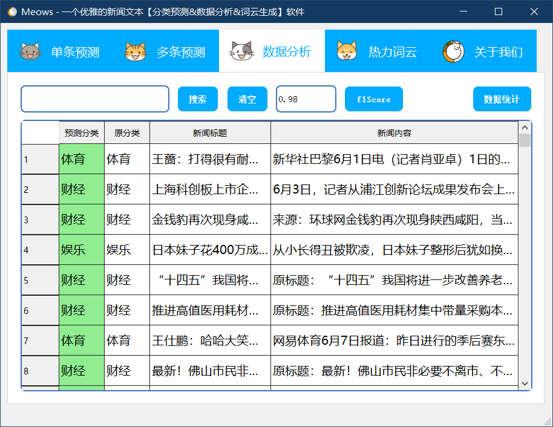
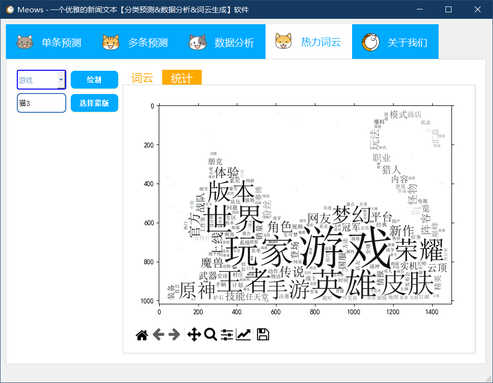

# Meows 
- 一个优雅的新闻文本【分类预测&数据分析&词云生成】软件
- 第十届中国软件杯，《新闻文本分类》赛题三等奖

## UI展示

 

 

 


## 如何使用

### 安装项目依赖

```shell
pip install requirements.txt
```

### 开始运行！

- PyCharm进行配置和编译运行

- 直接使用打包好的exe运行

```shell
python3 main.py
```

